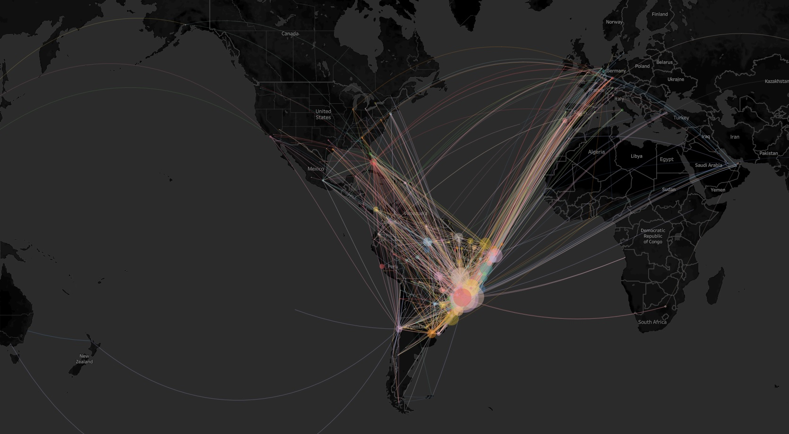

# Voos no Brasil 2019

## Sobre

Projeto de análise de voos no Brasil no ano de 2019.

Realizado extração de dados do site da Agência Nacional de Aviação Civil (ANAC), onde foram extraídos todos os voos registrados no ano de 2019. Após a extração foi realizado o tratamento dos dados e adição de features (exemplo: atraso de cada voo). Por último foram feitas análises dos dados coletados e tratados.

## Visualização

Foi realizado um mapa interativo do tráfego aéreo brasileiro no ano de 2019 utilizando o software Tableau.

[Clique aqui para acessar o mapa interativo.](https://public.tableau.com/profile/matheus8405#!/vizhome/flights_brazil_2019/Planilha1)

